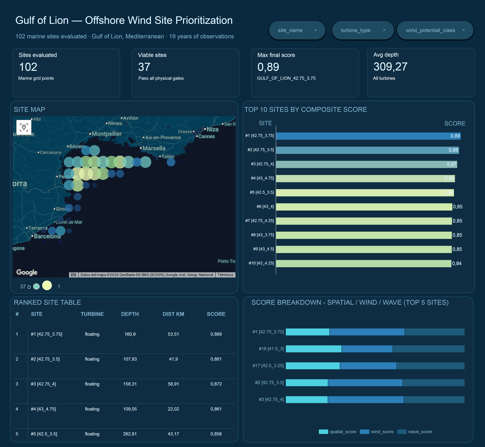

# Gulf of Lion — Offshore Wind Site Prioritization

An end-to-end batch data pipeline to identify and rank optimal offshore wind
turbine installation sites in the Gulf of Lion, using 19 years of historical
wind, wave, bathymetric, and coastline data across 111 raw grid points
(102 analysis ready sites) at 0.25° resolution.

> Developed as part of the
[Data Engineering Zoomcamp](https://github.com/DataTalksClub/data-engineering-zoomcamp)
capstone project.

---

## Dashboard

[](https://lookerstudio.google.com/s/ljbPw5trmGA)

> 🔗 [View the interactive dashboard](https://lookerstudio.google.com/s/ljbPw5trmGA)

The dashboard shows:
- 102 marine sites evaluated, 37 viable after physical gates
- Top 10 ranked sites by composite score (spatial 40% / wind 40% / wave 20%)
- Site map with bubble size proportional to rank
- Score breakdown per site showing contribution of each component
- Filters by turbine type, wind class, and survivability class

---

## Problem Statement

Where in the Gulf of Lion should offshore wind turbines be installed?

The Gulf of Lion (northwestern Mediterranean) is one of Europe's most
promising offshore wind zones. The
[EFGL project](https://www.eoliennesenmer.fr/efgl) is currently installing
the first commercial floating wind turbines there, with a 250MW follow-up
(EFLO) awarded in December 2024.

This pipeline analyses 19 years of ERA5 wind and wave reanalysis data across
a 0.25° grid to score and rank 102 confirmed marine grid cells by suitability
for offshore wind development, combining wind speed, wave survivability, sea
depth, and distance to coast into a single composite score.

### Beyond Commercial Development

Offshore wind suitability analysis is not only a tool for energy developers
— it is equally valuable for environmental planners, marine biologists, and
policymakers. The same pipeline that identifies the best turbine locations can
highlight areas most likely to be targeted for development, enabling proactive
environmental assessment before projects begin.

Future iterations are designed to incorporate:
- **Marine protected areas** (Natura 2000, IUCN categories)
- **Species migration corridors** — seabird flyways, cetacean feeding grounds
- **Benthic habitat maps** — seabed classification for impact assessment
- **Shipping lanes and fishing grounds** — conflict mapping

The architecture is deliberately extensible: adding a new spatial layer
requires only a new ingestion script and a new dbt staging model.

---

## Architecture
```
Open-Meteo API  ──┐
ETOPO 2022      ──┼──► Kestra / Python ──► GCS (Data Lake) ──► BigQuery ──► dbt ──► Looker Studio
Natural Earth   ──┘
```
---

## Data Sources

| Dataset | Source | Format | Coverage |
|---------|--------|--------|----------|
| Wind data | [Open-Meteo ERA5 Reanalysis](https://open-meteo.com/en/docs/historical-weather-api) | JSON via API | 111 grid points · 2006–2024 · hourly |
| Wave data | [Open-Meteo ERA5-Ocean](https://open-meteo.com/en/docs/marine-weather-api) | JSON via API | 111 grid points · 2006–2024 · hourly |
| Bathymetry | [ETOPO 2022 (NOAA)](https://www.ncei.noaa.gov/products/etopo-global-relief-model) | NetCDF via OPeNDAP | ~450m resolution · global |
| Coastline | [Natural Earth 1:10m Physical Vectors](https://www.naturalearthdata.com/downloads/10m-physical-vectors/) | Shapefile | Global coastline |

All data is free and publicly available. No API keys are required. Open-Meteo does not 
require authentication for historical reanalysis data.

---

## Project Structure
```
mediterranean-offshore-wind-pipeline/
├── Makefile                        # pipeline automation — run `make` to see all commands
├── README.md                       # project documentation
├── VALIDATION.md                   # data quality and scoring sanity checklist
├── areas.yaml                      # Gulf of Lion bounding box and grid resolution config
├── docker-compose.yml              # Kestra + Postgres services
├── requirements.txt                # Python dependencies
├── .env.example                    # environment variable template
├── grid_points.json                # generated 111 Gulf of Lion grid coordinates
│
├── assets/
│   └── dashboard.png               # dashboard screenshot for README
│
├── flows/                          # Kestra flow definitions
│   ├── site_key_values.yaml        # seeds 111 grid coordinates into KV store
│   ├── site_data_ingestion.yaml    # wind + wave ingestion for a single site
│   ├── site_data_backfill.yaml     # historical loop — 111 sites × 19 years
│   ├── wind_data_ingestion.yaml    # ERA5 wind data fetcher
│   └── wave_data_ingestion.yaml    # ERA5-Ocean wave data fetcher
│
├── scripts/                        # static reference data ingestion
│   ├── generate_grid.py            # generates marine grid points from areas.yaml
│   ├── load_bathymetry.py          # downloads ETOPO 2022, uploads to GCS + BigQuery
│   └── load_coastline_distance.py  # downloads Natural Earth coastline, computes distances
│
├── terraform/                      # infrastructure as code
│   ├── main.tf                     # GCS bucket + BigQuery datasets
│   └── variables.tf                # project ID, region, bucket name
│
├── keys/                           # GCP service account credentials (git-ignored)
│   └── google_credentials.json
│
└── dbt/                            # data transformations
    ├── dbt_project.yml             # dbt project config
    ├── packages.yml                # dbt dependencies
    ├── macros/
    │   ├── generate_grid_id.sql    # spatial join key macro
    │   └── get_custom_schema.sql   # BigQuery dataset routing
    ├── seeds/
    │   └── manually_excluded_sites.csv  # 2 sites excluded after QGIS visual inspection
    └── models/
        ├── staging/                # raw source cleaning and unit conversion
        │   ├── stg_wind.sql        # wind speed km/h → m/s, spatial_id key
        │   ├── stg_bathymetry.sql  # marine cells only, depth_m positive
        │   ├── stg_coastline_distance.sql  # marine pixels only, land excluded
        │   ├── stg_wave.sql        # raw wave observations
        │   └── sources.yml
        ├── intermediate/           # business logic and scoring
        │   ├── int_site_centers.sql           # 102 marine centroids from 111 wind points
        │   ├── int_site_spatial_samples.sql   # raster aggregation per grid cell
        │   ├── int_site_spatial_summary.sql   # depth + distance per site
        │   ├── int_site_spatial_score.sql     # depth_score, coast_score (0–1)
        │   ├── int_site_wind_summary.sql      # wind statistics per site
        │   ├── int_site_wind_score.sql        # wind_score (0–1)
        │   ├── int_site_wave_summary.sql      # wave statistics per site
        │   ├── int_site_wave_score.sql        # wave_score, survivability_class
        │   ├── int_site_composite_score.sql   # final_score with physical gates
        │   ├── int_site_composite_score_unfiltered.sql  # all 102 points for GIS
        │   └── schema.yml
        └── marts/                  # final outputs for dashboard and GIS
            ├── mart_offshore_site_prioritization.sql  # 37 ranked viable sites
            ├── mart_offshore_site_gis.sql             # all 102 points with viability_flag
            └── schema.yml
```

---

### Ingestion — Kestra flows

| Flow | Description |
|------|-------------|
| `site_key_values` | Seeds all 111 Gulf of Lion grid coordinates into KV store |
| `wind_data_ingestion` | Fetches ERA5 wind data per site, uploads to GCS, loads to BigQuery |
| `wave_data_ingestion` | Fetches ERA5-Ocean wave data per site, uploads to GCS, loads to BigQuery |
| `site_data_ingestion` | Runs wind + wave ingestion in parallel for a single site |
| `site_data_backfill` | Historical loop — 111 sites × 19 years (2006–2024) |

> **Note on site count:** Kestra ingests data for all 111 grid points defined
> in `areas.yaml`. 9 of these are inland grid cells that have no marine
> bathymetry coverage — their wind and wave data is downloaded but excluded
> at the first dbt join in `int_site_centers`. This is intentional: the grid
> was defined from wind data alone before bathymetry validation. The remaining
> 102 are confirmed marine sites used for scoring and ranking.

### Ingestion — Python scripts (static reference data)

| Script | Description |
|--------|-------------|
| `scripts/generate_grid.py` | Reads `areas.yaml`, queries BigQuery bathymetry, outputs marine grid points |
| `scripts/load_bathymetry.py` | Downloads ETOPO 2022 via OPeNDAP, uploads to GCS tile by tile |
| `scripts/load_coastline_distance.py` | Downloads Natural Earth 1:10m coastline, computes distance transform |

### dbt model DAG
```
STAGING
  stg_wind                  → raw wind observations, unit-converted to m/s
  stg_bathymetry            → marine cells only (elevation_m < 0), depth_m positive
  stg_coastline_distance    → distance to coast per marine pixel, land excluded
  stg_wave                  → raw wave observations

INTERMEDIATE
  int_site_centers          → 102 marine centroids parsed from 111 wind location keys
                              (9 inland points excluded via bathymetry inner join)
  int_site_spatial_samples  → raw raster aggregation per site grid cell
  int_site_spatial_summary  → one row per site, depth + distance aggregates
  int_site_spatial_score    → depth_score, coast_score, spatial_score (0–1)
  int_site_wind_summary     → one row per site, wind statistics aggregated
  int_site_wind_score       → wind_score (0–1), wind_potential_class
  int_site_wave_score       → wave_score (0–1), survivability_class
  int_site_composite_score  → final_score with physical gates applied
  int_site_composite_score_unfiltered → all 102 points, no gates (GIS use only)

MARTS
  mart_offshore_site_prioritization  → 37 filtered, ranked sites for decisions
  mart_offshore_site_gis             → all 102 points for GIS export
```

### Scoring methodology

| Component | Weight | Key inputs |
|-----------|--------|------------|
| Spatial | 40% | depth_m, distance_to_coast_km |
| Wind | 40% | avg_wind_speed_ms, p50, p90 |
| Wave | 20% | avg_wave_height_m, survivability_class |

Physical gates applied before ranking:
- `depth_m >= 10` and `depth_m <= 1000`
- Fixed turbines: `distance_to_coast_km >= 11`
- Floating turbines: `distance_to_coast_km >= 5`

Turbine classification:
- `depth_m <= 50` → fixed
- `50 < depth_m <= 300` → floating
- `depth_m > 300` → not viable (excluded from ranking)

### BigQuery tables

| Table | Rows | Partitioning |
|-------|------|--------------|
| `raw_wind_data` | ~18.5M — all 111 grid points | Partitioned by month, clustered by site |
| `raw_wave_data` | ~18.5M — all 111 grid points | Partitioned by month, clustered by site |
| `raw_bathymetry` | ~17M marine cells | WGS84 |
| `raw_coastline_distance` | ~17M cells | Land cells filtered in dbt |

### GCS structure
```
raw/
  wind/{SITE}/{start_date}_{end_date}.ndjson
  wave/{SITE}/{start_date}_{end_date}.ndjson
  bathymetry/tile_00.parquet ... tile_03.parquet
  coastline_distance/strip_*.parquet
```

---

## Tech Stack

| Layer | Tool |
|-------|------|
| Orchestration | Kestra v1.1 |
| Data Lake | Google Cloud Storage |
| Data Warehouse | Google BigQuery |
| Transformations | dbt |
| Dashboard | Looker Studio |
| Static ingestion | Python + xarray + geopandas + scipy |
| Infrastructure | Docker + Terraform |

---

## Results

After processing 40M+ rows across 19 years of observations:

| Metric | Value |
|--------|-------|
| Raw grid points ingested | 111 |
| Inland points excluded in dbt | 9 (no marine bathymetry samples) |
| Marine grid points | 102 |
| Sites passing all physical gates | 37 |
| Top ranked site | GULF_OF_LION_42.75_3.75 |
| Top composite score | 0.889 |
| All top 5 turbine type | Floating (90–260m depth) |
| Avg distance to coast (top 5) | 48km |

The top-ranked cluster sits in the central-western Gulf of Lion where depth
is in the 100–180m sweet spot for floating turbines and Mistral wind
conditions are strongest.

2 additional sites were manually excluded after visual confirmation in QGIS
that their centroids plot on land despite passing quantitative marine gates.
Both are documented in `seeds/manually_excluded_sites.csv` with full
reasoning and are visible in the GIS mart with a `viability_flag` for
transparency.

---
## Data Validation

A full data validation and scoring sanity checklist is available at
[`VALIDATION.md`](VALIDATION.md).

It covers:
- Row count checks at every pipeline stage
- Physical sanity checks (depths, coordinates, distances)
- Score distribution and differentiation checks
- Wind/wave correlation analysis (Mistral effect)
- Gate consistency verification — confirms no site violates physical rules
- Weight sensitivity analysis — confirms top rankings are stable across weight variations
- GIS verification checklist for QGIS land mask cross-reference

Run all checks after every `dbt build` and before any merge to main.

## How to Reproduce

### Prerequisites
### Prerequisites
- Docker & Docker Compose
- Python 3.11+ with venv
- GCP project with service account (`Storage Object Admin`,
`BigQuery Data Editor`, `BigQuery Job User`)
- Terraform v1.5+ — if not installed, `make infra` will install it automatically

### Quick start
```bash
cp .env.example .env    # fill in your GCP credentials
make setup              # Python environment
make infra              # Terraform — provision GCP resources
make services           # Docker Compose — start Kestra
make wait               # wait for Kestra to be healthy
make ingest             # load bathymetry + coastline (~30 min)
make flow-keys          # seed 111 grid coordinates into Kestra KV store
make flow-test          # optional: test one site before full backfill
make flow-backfill      # full historical ingestion (~2-4 hours)
make dbt                # run all dbt models and tests
```

Or run everything at once after filling `.env`:
```bash
make all
```

Type `make` with no arguments to see all available commands.

### Step by step

#### 1. Clone and configure
```bash
git clone https://github.com/bernirazquin/mediterranean-offshore-wind-pipeline
cd mediterranean-offshore-wind-pipeline
cp .env.example .env
```

Fill in `.env`:
```bash
GCP_PROJECT_ID=your-project-id
GCP_SERVICE_ACCOUNT_B64=$(base64 -i keys/google_credentials.json | tr -d '\n')
GCS_BUCKET=your-bucket-name
```

#### 2. Provision infrastructure
```bash
make infra
```

#### 3. Start services
```bash
make services
```
Kestra UI → http://localhost:8080 (`admin@wind.com` / `Admin1234!`)

#### 4. Generate grid points
```bash
make setup
export GCP_PROJECT_ID=your-project-id
python scripts/generate_grid.py
```

#### 5. Load static reference data
```bash
make ingest
```

#### 6. Run Kestra flows

| Step | Command | Description |
|------|---------|-------------|
| 1 | `make flow-sync` | Sync flow YAML files from repo to Kestra |
| 2 | `make flow-keys` | Seed 111 grid coordinates into KV store |
| 3 | `make flow-test` | Optional: test one site before full backfill |
| 4 | `make flow-backfill` | Full historical ingestion (~2-4 hours) |

> The backfill ingests wind + wave data for all 111 grid points including
> the 9 inland ones. Those 9 are excluded later in dbt — ingesting them
> is harmless and avoids needing to pre-filter the grid.

> **Note:** The Kestra KV store needs to be re-seeded any time Docker 
> volumes are reset or Kestra is restarted from scratch. `make flow-test` 
> does this automatically. For manual runs use `make flow-keys` first.

#### 7. Run dbt transformations
```bash
make dbt
```
Expected output: 121/121 nodes passing.

#### 8. View dashboard
Open the
[Looker Studio dashboard](YOUR_LOOKER_STUDIO_LINK_HERE)
or connect your own Looker Studio instance to
`mart_offshore_site_prioritization` and `mart_offshore_site_gis`
in BigQuery.

---

## Known Limitations

- Wave data uses ERA5-Ocean model which has coarser resolution than wind data
- Distance calculation uses mean latitude (~42°N) for WGS84 correction —
~2% error at bounding box edges
- `marine_coverage_pct >= 0.90` gate allows up to 10% land contamination
per grid cell — 2 edge cases manually excluded, others should be verified
against a high-resolution land mask
- Wind and wave summaries are computed for all 111 sites including the 9
that are later excluded in dbt — acceptable at current scale

---

## Roadmap
- [ ] Daily schedule for forward updates
- [ ] Additional area support via `areas.yaml` (Bay of Biscay, Aegean)
- [ ] High-resolution land mask verification for all coastal sites
- [ ] Natura 2000 protected areas overlay
- [ ] Shipping lanes and fishing grounds conflict layer
- [ ] Additional variables: `wind_speed_80m`, `wind_gusts_10m`,
`swell_wave_height`
